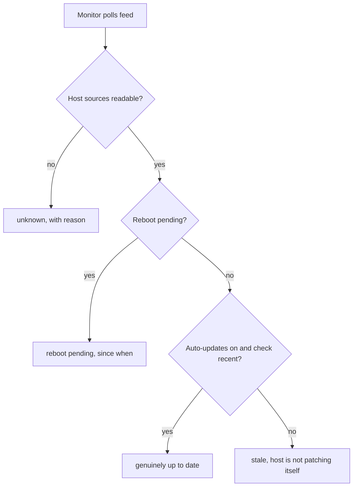

# Server Reboot Status in the Pulse Feed - Plan

## Goal Capsule

- **Objective:** Astuteo learns that a client's server is waiting on a reboot without anyone logging into it, and knows which sites go down when that reboot happens.
- **Means:** A host reader service reads web-readable files under an injectable root, the result is folded into the existing feed payload, and the endpoint credential moves to a request header with a query-parameter fallback (KTD1, KTD7).
- **Product authority:** This plan. The monitor that consumes the feed is a separate body of work and is not active scope here.
- **Open blockers:** None. The coordinated-release dependency is dissolved by KTD7's fallback.
- **Execution profile:** Standard depth, six units. U1 through U4 are dependency-ordered; U5 and U6 are independent of them.
- **Stop conditions:** Stop and report rather than guessing if a source path or its permissions on a real client host differ from the Dependencies / Assumptions list. Stop if the monitor turns out to reject an added payload key (see Risks).
- **Tail ownership:** The removal of the query-parameter fallback is a later release, not this one.

**Product Contract preservation:** unchanged. R1 through R11 and KD1 through KD8 carry their original IDs and meaning. Outstanding Questions were planning-owned and are resolved in place into KTD3, KTD5, and KTD8.

---

## Product Contract

### Summary

Add a host block to the Pulse feed that reports whether the server is waiting on a reboot, how long it has been waiting, and whether the server is patching itself at all. Every value is a boolean, timestamp, duration, or opaque identifier, so a leaked API key discloses nothing an attacker can match to a vulnerability. It reads only sources the web user can already read, so it works on every install with no server-side setup.

### Problem Frame

Nothing checks a client server's patch state today. There is no cadence, no dashboard, and no alert. Someone learns a box is behind when a failure, a client, or a security notice tells them.

The specific blind spot is narrower than "unpatched." Updates that install cleanly are largely self-correcting. Updates that stage successfully but need a reboot to take effect sit indefinitely, invisible, on a server that reports itself as running fine. Nobody logs in to check, so nobody reboots.

Pulse already polls every client site and already reads files off the server to build its feed. The server's own patch state is the one thing it does not report, and it is the thing nobody is watching.

### Key Decisions

- KD1. **Zero server-side setup.** The block reads only what the web user can already read, with no cron, systemd unit, snapshot file, or console command to provision. A per-server setup step would go unperformed on exactly the neglected servers this exists to surface. Governs R8.
- KD2. **An unreadable source reports as unknown, never as healthy.** The reboot flag only appears when something staged an update, so its absence is ambiguous by construction, and every other read fails the same way. Governs R5.
- KD3. **Liveness signals ship with the reboot signal.** Whether the host patches itself and when it last checked are what make a negative answer trustworthy; without them the flag is silently wrong on the worst servers. Governs R3, R4.
- KD4. **Nothing on the wire is a version, package name, or count.** Chosen against reporting exact OS version, kernel, pending counts, release EOL, and capacity, all of which were scoped in and then cut: the disclosure cost of a fleet-wide fingerprint outweighed their value against a narrow need. Governs R7.
- KD5. **Host identity travels with the block.** Several client sites commonly share one server; without an identifier the fleet view inflates one neglected machine into several rows and nobody can tell what a reboot takes down. Governs R6.
- KD6. **Hardening is part of this work, not a follow-up.** The block makes a leaked key materially more valuable even at reduced resolution, and the existing query-parameter key is the only control. Governs R10.
- KD7. **The plugin emits state; the monitor decides.** No ok/attention/unknown verdict is computed here, because changing a threshold would otherwise mean redeploying the plugin across the client fleet.
- KD8. **Support is decided by whether a source reads, not by which distribution the host runs.** Chosen against naming supported distributions, which would require putting an OS identifier on the wire or maintaining an allowlist as distributions change. Debian and Ubuntu share the same layout and both work under this rule without being named. Governs R11.

### Requirements

**Reboot signal**

- R1. The feed reports whether the host is waiting on a reboot.
- R2. The feed reports how long the host has been waiting on that reboot.

**Trustworthy negatives**

- R3. The feed reports whether the host's unattended update mechanism is enabled.
- R4. The feed reports when the host's update check last ran.
- R5. When a host source cannot be read or does not exist, the field reports as unknown with a machine-readable reason, never as a healthy value.

**Fleet identity**

- R6. The feed carries a stable, opaque identifier for the physical host, so several sites on one server are recognizable as one machine.

**Exposure and delivery**

- R7. Every host value in the feed is a boolean, timestamp, duration, or opaque identifier. No version string, package name, or count appears.
- R8. The host block is present on every install with no per-server or per-site configuration, reading only sources available to the web user without elevated privileges.
- R9. A failure to read any host source degrades that field per R5 and leaves the rest of the feed unaffected.
- R10. The endpoint accepts its credential as a request header rather than a query parameter, shipping in the same release as the host block.
- R11. The plugin performs no operating-system detection. A source that reads produces a value; a source that does not produces unknown per R5.

R1 through R5 exist to keep four states distinguishable. The failure mode is that the last two collapse into "up to date":

### Acceptance Examples

- AE1. Reboot genuinely pending
  - **Covers R1, R2, R7.**
  - **Given:** an Ubuntu host where a kernel update staged four days ago and the server has not rebooted.
  - **Then:** the feed reports a pending reboot and a four-day duration, with no package names.
- AE2. Genuinely up to date
  - **Covers R1, R3, R4.**
  - **Given:** a host with unattended updates enabled, an update check within the last day, and no pending reboot.
  - **Then:** the feed reports no pending reboot, updates enabled, and a recent check timestamp.
- AE3. Host has stopped patching itself
  - **Covers R3, R4, R5.**
  - **Given:** a host where the update timer is disabled, so nothing ever stages and no reboot flag ever appears.
  - **Then:** the feed reports no pending reboot alongside updates disabled and a stale or absent check timestamp, so the monitor can distinguish this host from AE2.
- AE4. Sources unavailable
  - **Covers R5, R9, R11.**
  - **Given:** a container, or any host where the sources are absent or unreadable.
  - **Then:** each affected field reports unknown with a reason, and every non-host field in the feed is unchanged.
- AE5. Several sites on one server
  - **Covers R6.**
  - **Given:** four client sites hosted on one machine with a pending reboot.
  - **Then:** all four responses carry the same host identifier, so the monitor can resolve them to one reboot affecting four sites.

### Success Criteria

- An operator can answer "does any client server need a reboot right now, and what goes down if I reboot it" from the monitor alone, without opening an SSH session.
- A server that has stopped patching itself is distinguishable in the feed from one that is up to date. This is the case the feature exists to catch and the one a naive implementation gets wrong.
- A reader holding a leaked API key learns no host version, package name, or count from any site in the fleet.

### Scope Boundaries

- The sidecar snapshot mechanism originally proposed, along with cron, systemd units, and a plugin console command, is rejected rather than deferred. Reintroducing it would reintroduce per-server provisioning.
- Facts requiring root are permanently out under KD1: unattended-upgrades log contents, live `apt-check` output, and Ubuntu Pro or ESM status.
- OS version, running kernel, pending and security update counts, release EOL date, and disk, memory, and load were scoped in during dialogue and then cut under KD4. They are not deferred; reinstating any of them reopens that decision.
- Monitor-side work is out: rendering the block, grouping sites onto servers by R6's identifier, alerting, and thresholds.
- Triggering, scheduling, or performing a reboot is out. This plan reports state.
- Operating-system detection and a supported-distribution allowlist are out under KD8. An IP allowlist and a second credential for the host block were considered as hardening and rejected in favor of R10.

#### Deferred to Follow-Up Work

- Removing the query-parameter credential fallback. That is a later release, gated on the monitor having switched (KTD7).
- The feed already returns the site's full `package.json` and its `todo-*.md` files through the same key-gated endpoint. That is arguably a larger disclosure than anything this plan adds, and it deserves its own decision.
- `Craft::$app->updates->getUpdates(1)` runs before the authorization check at [src/services/BroadcastStatusService.php:51](src/services/BroadcastStatusService.php:51), so an unauthenticated request triggers an update fetch. Moving it below the check is a one-line change but sits outside the confirmed scope.
- Dead code removal: `makeReport()` at [src/services/BroadcastStatusService.php:26](src/services/BroadcastStatusService.php:26) is called by nothing.
- CI to actually run the test suite added in U1.

### Dependencies / Assumptions

- **The host source paths need confirming on a live host.** They were established from Debian and Ubuntu documentation, not from a client server. Confirm existence and permissions before U2 is considered done: `/var/run/reboot-required`, `/usr/share/update-notifier/notify-reboot-required`, `/etc/apt/apt.conf.d/20auto-upgrades`, `/var/lib/apt/periodic/update-success-stamp`, `/var/lib/update-notifier/updates-available`, and `/etc/machine-id`.
- **`/var/run` is tmpfs**, cleared on boot, which is what makes the reboot flag's modification time a true pending-since value for R2.
- **Hosts are assumed to be Ubuntu VPS-style machines with a real OS layer.** Managed and containerized hosting falls through to R5 rather than getting its own handling.
- **The driver is a known blind spot, not a measured cost.** No incident count or outage was tallied for this.
- **Monitor-side behavior is unverified.** Nothing in this repo proves the monitor tolerates an added payload key. KTD7's fallback removes the auth coupling, but not this one.

### Outstanding Questions

None block implementation. The three questions the brainstorm deferred to planning are resolved in KTD3, KTD5, and KTD8.

---

## Planning Contract

### Key Technical Decisions

- KTD1. **A separate `HostStatusService` reads host state, taking a root path as a constructor argument.** The injectable root is what makes AE1 through AE5 reproducible from fixture directories rather than only on a live server; it defaults to `/` in production. Implements KD1. Governs R8, and enables the test approach in U1.
- KTD2. **Presence of the reboot-notifier helper is read as a distinct signal.** `/var/run/reboot-required` is created only when a package's postinst calls `/usr/share/update-notifier/notify-reboot-required`, which does not exist unless `update-notifier-common` is installed. Without this check, a host that can never raise the flag is indistinguishable from a healthy one. When the helper is absent, `reboot_pending` is unknown, not false. Implements KD2 per R1, R5.
- KTD3. **Freshness reads two sources, stat only, never contents.** `/var/lib/apt/periodic/update-success-stamp` is primary and `/var/lib/update-notifier/updates-available` is the fallback; only their modification times are used. Reading the latter's contents would put human-readable update counts and Ubuntu Pro status into the payload and break R7. Resolves the deferred question about R4's authoritative source. Governs R4, R7.
- KTD4. **The plugin emits `reboot_pending_since` as an ISO 8601 timestamp, not a computed duration.** The monitor derives elapsed time, which keeps clock interpretation on one side and matches KD7. Satisfies R2 within R7's allowed value types.
- KTD5. **The host identifier is an HMAC-SHA256 of `/etc/machine-id`, keyed by a fixed constant in the plugin source.** systemd documentation states the machine ID must not be exposed on a network and must be hashed with an application-specific key if a stable identifier is needed. The key must be identical on every install or sites on one server would produce different identifiers and R6 would fail. This repository is public, so the key is public: reversal resistance therefore rests on the machine ID's 128 bits of entropy rather than on key secrecy, which is sufficient for systemd's requirement. What a public key does forfeit is cross-application correlation resistance, and no other application uses this key. Rotating the key later would break identifier continuity for every host. Implements KD5. Governs R6, R7.
- KTD6. **The host block nests under `data.host` in the existing envelope.** One added key, no change to any existing key. Resolves the deferred question about payload shape. Governs R8.
- KTD7. **`checkAuthorized()` accepts the credential from an `X-Astuteo-Pulse-Key` request header, falling back to the `key` query parameter.** (session-settled: user-approved — chosen over a hard cutover: client sites update on their own schedules, so plugin and monitor will not deploy together and a hard cutover would take sites dark.) The comparison moves to `hash_equals` for constant-time behavior. Implements KD6. Governs R10.
- KTD8. **No staleness threshold is computed in the plugin.** R4 emits a timestamp and the monitor decides what counts as stale. Resolves the second half of the deferred R4 question and follows KD7.
- KTD9. **Every source read is wrapped so a failure yields unknown plus a reason rather than an exception.** A permission change on one file must not take the whole feed down. Implements KD2. Governs R5, R9.

### High-Level Technical Design

Each emitted field maps to exactly one source, and each has a defined unknown path. This mapping is the load-bearing part of U2.

| Field | Source (under injectable root) | Read | Unknown when |
|---|---|---|---|
| `reboot_pending` | `var/run/reboot-required` | existence | notifier helper absent (KTD2) |
| `reboot_pending_since` | `var/run/reboot-required` | mtime | not pending, or unreadable |
| `auto_updates_enabled` | `etc/apt/apt.conf.d/20auto-upgrades` | contents, parsed | file absent or unparseable |
| `last_check_at` | `var/lib/apt/periodic/update-success-stamp`, else `var/lib/update-notifier/updates-available` | mtime only (KTD3) | neither source present |
| `host_id` | `etc/machine-id` | contents, HMAC'd (KTD5) | file absent or empty |

Two sources are read for their existence or modification time and never for their contents: `reboot-required` and `updates-available`. Treating either as readable text is the R7 violation this table exists to prevent.

### Assumptions

- PHPUnit 10 or later is compatible with the plugin's `php: ^8.2` floor and can be added to `require-dev` without disturbing the Craft 4 and 5 support range.
- The web user can read all six source paths on a stock host. This is the assumption the Dependencies list calls out for confirmation.

### Risks

- **The monitor may reject an added payload key.** Nothing in this repo proves otherwise, and U4 changes the payload every client site returns. Verify against the monitor before U4 ships. This is the plan's only unmitigated cross-system risk.
- **The six source paths came from documentation, not a client server.** If any path or permission differs, U2's field mapping is wrong in a way fixture tests cannot catch, because the fixtures encode the same assumption. The live confirmation gate in the Verification Contract is the only check that closes this.
- **A public repository makes the KTD5 key public.** Accepted, with the reasoning recorded on KTD5.
- **Adding PHPUnit touches the dependency range** the plugin resolves against for Craft 4 and 5. Low likelihood, but it is the one change in this plan that can break an install rather than a response.

### Sequencing

U1 precedes U2 because U2's test scenarios need the fixture harness. U2 precedes U3 and U4. U5 and U6 are independent and can land in any order.

---

## Implementation Units

### U1. Test harness and host-state fixtures

- **Goal:** Give the repo a runnable test suite and fixture directory trees that reproduce each host state without a server.
- **Requirements:** Enables verification of R1 through R11. Implements KTD1's testability rationale.
- **Dependencies:** None.
- **Files:**
  - `composer.json` (add `phpunit/phpunit` to `require-dev`, add a `test` script)
  - `phpunit.xml`
  - `tests/fixtures/reboot-pending/` (notifier helper, `reboot-required`, auto-upgrades config, success stamp, machine-id)
  - `tests/fixtures/up-to-date/`
  - `tests/fixtures/updates-disabled/`
  - `tests/fixtures/notifier-absent/`
  - `tests/fixtures/bare/` (no host sources at all)
- **Approach:**
  1. Add PHPUnit to `require-dev` and a `test` script to the existing `scripts` block.
  2. Create one fixture directory per host state, each mirroring the real path layout beneath a fake root.
  3. Give `machine-id` fixtures a fixed known value so U3's derivation assertions are deterministic.
- **Patterns to follow:** The existing `scripts` block in `composer.json` already defines named commands; follow its shape.
- **Test scenarios:** `Test expectation: none -- scaffolding unit with no behavior of its own.`
- **Verification:** `composer test` runs and reports zero tests without error.

### U2. Host state reader

- **Goal:** Read every host field from an injectable root and return a structured result where each field is either a value or unknown with a reason.
- **Requirements:** R1, R2, R3, R4, R5, R7, R8, R9, R11. Implements KTD1, KTD2, KTD3, KTD4, KTD9.
- **Dependencies:** U1.
- **Files:**
  - `src/services/HostStatusService.php` (new)
  - `tests/HostStatusServiceTest.php` (new)
- **Approach:**
  1. Constructor takes a root path defaulting to `/`.
  2. Resolve each field per the High-Level Technical Design table, wrapping every filesystem call per KTD9.
  3. Gate `reboot_pending` on the notifier helper's presence per KTD2 before treating the flag's absence as false.
  4. Read only the modification time of `update-success-stamp` and `updates-available` per KTD3.
  5. Emit `reboot_pending_since` as ISO 8601 per KTD4.
- **Execution note:** Write the fixture test for the notifier-absent case before the reader. That case is the one an obvious implementation gets wrong, and it should fail first.
- **Patterns to follow:** `_packageJson()` and `_todos()` in [src/services/BroadcastStatusService.php:104](src/services/BroadcastStatusService.php:104) already guard file reads with `file_exists` before `file_get_contents`; keep that shape but return unknown-with-reason instead of an empty string.
- **Test scenarios:**
  - Covers AE1. Root with the notifier helper present and `reboot-required` touched to a known past time reports pending true and that timestamp.
  - Covers AE2. Root with the helper present, no `reboot-required`, auto-upgrades enabled, and a recent success stamp reports pending false, updates enabled, and that timestamp.
  - Covers AE3. Root with auto-upgrades set to `"0"` and an old success stamp reports pending false, updates disabled, and the old timestamp.
  - Covers AE4. Bare root with no host sources reports every field unknown, each with a distinct reason.
  - Notifier helper absent but all other sources present reports `reboot_pending` unknown, not false.
  - `update-success-stamp` absent but `updates-available` present resolves `last_check_at` from the fallback source.
  - An `auto-upgrades` file with unexpected content reports unknown with a parse reason rather than throwing.
  - A source path that exists but is unreadable reports unknown with a reason and does not raise.
  - No returned field is a string containing a digit sequence sourced from `updates-available` contents, guarding R7 against a future refactor reading that file.
- **Verification:** All fixture states resolve to the expected field set, and no test reads `updates-available` contents.

Fixture modification times cannot come from git, which does not preserve them. Each test must `touch` its fixture files to a known time during setup, or the time-dependent assertions will pass locally and fail on a fresh clone.

### U3. Host identity derivation

- **Goal:** Produce a stable identifier for the physical host that is identical across every site on that host and does not disclose the machine ID.
- **Requirements:** R6, R7. Implements KTD5.
- **Dependencies:** U1, U2.
- **Files:**
  - `src/services/HostStatusService.php` (modify)
  - `tests/HostIdentityTest.php` (new)
- **Approach:**
  1. Read `etc/machine-id` under the injectable root.
  2. Derive the identifier with `hash_hmac('sha256', $machineId, self::HOST_ID_KEY)`, where the key is a fixed class constant.
  3. Return unknown with a reason when the file is absent or empty, per KTD9.
- **Patterns to follow:** None in this repo; this is the first cryptographic derivation in the plugin.
- **Test scenarios:**
  - Covers AE5. Two reader instances over the same fixture root produce the same identifier.
  - Two fixture roots with different machine-id values produce different identifiers.
  - The returned identifier does not contain the machine-id value as a substring.
  - An absent `machine-id` returns unknown with a reason rather than an empty or null-derived hash.
  - An empty `machine-id` file returns unknown rather than the HMAC of an empty string.
- **Verification:** Identity is stable across calls, differs across hosts, and never echoes its input.

### U4. Fold the host block into the feed

- **Goal:** Add the host block to the existing payload without altering any existing key.
- **Requirements:** R8, R9. Implements KTD6.
- **Dependencies:** U2, U3.
- **Files:**
  - `src/services/BroadcastStatusService.php` (modify)
  - `tests/BroadcastPayloadTest.php` (new)
- **Approach:**
  1. Add a `host` key to the `data` array built at [src/services/BroadcastStatusService.php:60](src/services/BroadcastStatusService.php:60).
  2. Call `HostStatusService` behind a guard so a reader failure degrades the block per R9 rather than the response.
- **Patterns to follow:** The existing private static helpers in `BroadcastStatusService` each return one payload value; follow that shape for the host block's accessor.
- **Test scenarios:**
  - The payload contains `data.host` with the expected field names.
  - Every pre-existing `data` key is present and unchanged when the host block is added.
  - A reader that throws leaves every non-host field intact and reports the host block as unknown.
  - Every value under `data.host` is a boolean, null, an ISO 8601 timestamp string, or the hex identifier. Asserting the allowed type set is what mechanically guards R7 against a future refactor, since asserting the absence of a count is not checkable.
- **Verification:** The JSON route returns the added block and every previously present key.

### U5. Header credential with query-parameter fallback

- **Goal:** Accept the credential from a request header while continuing to accept the query parameter, so sites and monitor can deploy independently.
- **Requirements:** R10. Implements KTD7 (session-settled).
- **Dependencies:** None.
- **Files:**
  - `src/services/BroadcastStatusService.php` (modify `checkAuthorized()`)
  - `tests/AuthorizationTest.php` (new)
- **Approach:**
  1. Read `X-Astuteo-Pulse-Key` from the request headers first.
  2. Fall back to the existing `key` query parameter when the header is absent.
  3. Compare with `hash_equals` rather than `===`.
  4. Guard the environment value before comparing. `getenv()` returns `false` when `ASTUTEO_API_KEY` is unset, and `hash_equals` raises a `TypeError` on a non-string argument, so an unconfigured site would return a 500 instead of rejecting.
- **Patterns to follow:** `checkAuthorized()` at [src/services/BroadcastStatusService.php:36](src/services/BroadcastStatusService.php:36) already reads from `Craft::$app->request`; extend it rather than introducing a new access path.
- **Test scenarios:**
  - A correct header credential authorizes.
  - A correct query-parameter credential still authorizes, with no header present.
  - A correct header wins when the query parameter is present and wrong.
  - A wrong credential in either position is rejected.
  - A request with no credential in either position is rejected.
  - An unset `ASTUTEO_API_KEY` environment variable rejects rather than authorizing.
- **Verification:** Both credential positions authorize, and the existing monitor call keeps working unchanged.

### U6. Update the README

- **Goal:** Replace documentation that describes a removed integration with the current endpoints and credential.
- **Requirements:** Supports R10 by documenting the interface it changes.
- **Dependencies:** None.
- **Files:** `README.md`
- **Approach:**
  1. Remove the Airtable setup section and the `take-pulse` console action, neither of which exists.
  2. Document `/astuteo-pulse` and `/astuteo-pulse/json`, the `X-Astuteo-Pulse-Key` header, and the deprecated query parameter.
  3. Document the host block's fields and state that it needs no server-side setup.
- **Patterns to follow:** Keep the existing README's short, plain structure.
- **Test scenarios:** `Test expectation: none -- documentation only.`
- **Verification:** No instruction in the README refers to code that does not exist.

---

## Verification Contract

| Gate | Command | Applies to |
|---|---|---|
| Test suite | `composer test` | U1, U2, U3, U4, U5 |
| Payload shape | Request `/astuteo-pulse/json` with a valid header credential and inspect `data.host` | U4 |
| Backward compatibility | Request the same route with the query-parameter credential | U5 |
| Live source confirmation | Check the six paths in Dependencies / Assumptions on a real client host | U2, U3 |

The live source confirmation is not optional. Every path in this plan came from documentation rather than from a client server, and U2's correctness rests on them.

## Definition of Done

**Global**

- `composer test` passes.
- The six source paths are confirmed on at least one real client host, or any difference is recorded and the plan updated.
- No host value in the payload is a version string, package name, or count (R7).
- The feed's pre-existing keys are unchanged (R8, R9).
- Both credential positions authorize (R10).
- Abandoned or experimental code from the implementation run is removed rather than left in the diff.

**Per unit**

- U1: `composer test` runs; one fixture directory exists per host state.
- U2: every state in the High-Level Technical Design table resolves correctly, including the notifier-absent case.
- U3: the identifier is stable per host, differs across hosts, and never contains its input.
- U4: `data.host` is present and no existing key changed.
- U5: header and query parameter both authorize; comparison is constant-time.
- U6: the README describes only endpoints and options that exist.

---

## Sources / Research

- [src/services/BroadcastStatusService.php:60](src/services/BroadcastStatusService.php:60). The `{status, message, data}` envelope the host block joins.
- [src/services/BroadcastStatusService.php:104](src/services/BroadcastStatusService.php:104). `_packageJson()` and `_todos()` already read files off the server into the feed, the same shape R8 needs.
- [src/services/BroadcastStatusService.php:36](src/services/BroadcastStatusService.php:36). The `checkAuthorized()` query-parameter key comparison that R10 hardens.
- [src/AstuteoPulse.php:39](src/AstuteoPulse.php:39). Site URL rules registering `/astuteo-pulse` and `/astuteo-pulse/json`.
- The plugin has no console command, queue job, or scheduled execution. Every request arrives as the web user through PHP-FPM, which is why KD1 rules out anything the plugin would have to refresh on its own.
- systemd `machine-id(5)`: the machine ID must be considered confidential, must not be exposed on a network, and must be hashed with an application-specific key when a stable identifier is needed. Source of KTD5. <https://www.freedesktop.org/software/systemd/man/latest/machine-id.html>
- `/var/run/reboot-required` is written only by `/usr/share/update-notifier/notify-reboot-required`, called from package postinst hooks, and Debian provides it only with `update-notifier-common` installed. `/var/run` is tmpfs. Source of KTD2 and the R2 mtime assumption. <https://discourse.ubuntu.com/t/file-var-run-reboot-required-not-present-after-kernel-update/54134>
- `/var/lib/update-notifier/updates-available` holds the human-readable output of `apt-check --human-readable`, including update counts and ESM status, and is consumed by `/etc/update-motd.d/90-updates-available`. Source of KTD3's stat-only rule. <https://wiki.ubuntu.com/UpdateNotifier>
